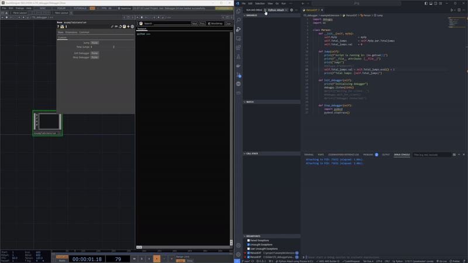

> This is a working proof of concept for debugging python code executing inside of Touchdesigner. Can trigger breakpoints and watch the execution state (inspect variables). Tested in Touchdesigner 2022.31030.



# 🛠 Setup

📽 You can alternatively follow [this video tutorial](https://youtu.be/Dc1tJpdgRW8).

1. 🐍 Install `debugpy` in Touchdesigner's python installation:

   1. In Touchdesigner's textport execute:

      ```python
      print(sys.exec_prefix)
      ```

   2. 📂 Go to the path in the output and open a `cmd` console there. Run:

      ```shell
      python -m pip install debugpy
      ```

   3. ❗ If there is an error saying `No module named pip`, you can use [this solution](https://stackoverflow.com/questions/9780717/bash-pip-command-not-found/57666133#57666133). Translated to Windows it would be:

      1. 🌐 Go to [the link](https://bootstrap.pypa.io/get-pip.py) in a browser and save the file (`ctrl+s`).

      2. 📂 Put it in the path where the `python.exe` is located (output of step 1.1).

      3. ⌨️ On a command prompt located there run:

         ```shell
         arduinoCopy code
         python get-pip.py
         ```

      4. 🔄 Restart the console and try step 1.2 again.

2. 🛣️ Touchdesigner paths <u>have to be replicated</u> in Windows file system for breakpoints to trigger:

   1. 📂 Put the `TD_debugger` folder directly in your C drive.
   2. 📂 Put the `.vscode` inside `TD_debugger` directly in your C drive.

3. 🖥️ Open Visual Studio Code in your C drive.

4. 🎨 Open Touchdesigner. Go to `TD_debugger/exampleExtension` and in the custom parameters press `Init Debugger` to launch our own debugpy server. Wait for it to time out and throw an error.

5. 🕹️ Connect vscode by going to the Debug tab and pressing the play button. If it asks, select the option `Attach using Process ID`. A dropdown should open, type `Touchdesigner` and select that process.

🔍 If the bottom bar turns orange it means that it was able to connect successfully. Add a breakpoint in line 15 in vscode and trigger a Jump in the exampleExtension using the jump pulse. Vs code should stop at that line and allow you to inspect the state of the program in the left column.


# 🤔 How does this work?

I think that vscode injects a dll in the running Touchdesigner process which launches a debugpy server to which the vscode debugger connects to.

**❓ Why do we have to launch our own debugpy server then?**

I have no idea but it doesn't connect if we don't launch it first.

**❓ Isn't it obvious that it connects to the server we launch then?**

Could be but I don't think so because I've tried stopping the server and as long as we have launched our own server once, vscode is able to connect from that point forward. Maybe the way I'm stopping the debugpy server is not right.

**❓ Why not just use our own debugpy server?**

If I explicitly tell the debugger to connect to my debugpy server (setting the ip and port in the `launch.json`) it doesn't connect, I don't know why. I was able to get this working at some point but couldn't replicate it. However, when it worked, I wasn't able to stop the session and reconnect; I had to close Touchdesigner and open it again.


# 📝 To do

-  🚀 Figure out how to use the `pathMappings` in `.vscode/launch.json` in order to not have to recreate the exact touchdesigner paths in Windows.